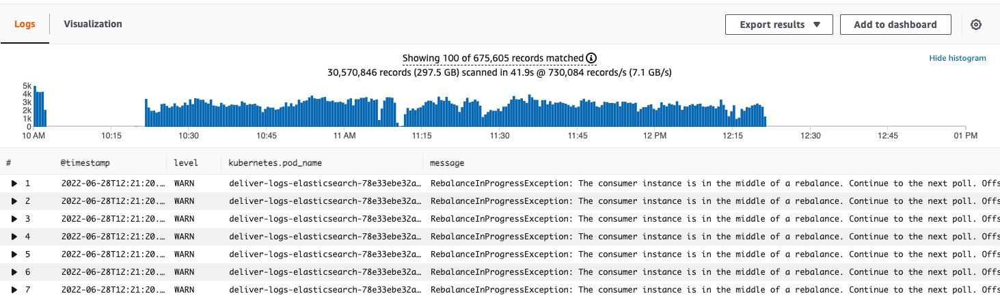

# Confluent Ticket
This repo contains files to support the ticket opened at Confluent Support Portal.

## Context
We're having issues in our `prod-eu-2` cluster (ID lkc-9k76q0) related with rebalances.

This cluster has peaks of 15000 messages per second but we expect to have a lot more soon.
These are peaks, not a constant rate, and for that reason the number of consumers is also not constant.

The consumers are instances of a Spring Boot application running in a Kubernetes cluster with 6 minimum and 20 maximum replicas.
The number of partitions in our topics is therefore 20, although it could be lower since each replica is able to handle around 2000 messages per second during the peaks.

We understand that scaling up or down the replicas of our consumers will cause rebalances, but what we don't understand is why are rebalances taking so long to complete, and why are some rebalances happening even when we're not scaling.

One of the major requirements for our system is the latency. In other words, we need to process messages in the least amount of time possible, and these rebalances are impacting on our ability to comply with that requirement.

Our Kafka consumer is a custom one, written by us. It consumes data from a Kafka topic and sends it to a destination (Elasticsearch, S3 bucket, HTTP endpoint, etc.). We're controlling the offset commit ourselves, and here are the Kafka consumer settings we're using:
```
bootstrap.servers = ...
group.id = ...
auto.offset.reset = latest
ssl.protocol = TLS
security.protocol = SASL_SSL
sasl.mechanism = ...
sasl.jaas.config = ...
fetch.max.bytes = 52428800 (50 mebibytes - default value)
max.poll.records = 500 (default value)
session.timeout.ms = 120000 (120 seconds - not default value - 45 seconds)
max.poll.interval.ms = 300000 (5 minutes - default value)
group.instance.id = $HOSTNAME
partition.assignment.strategy = org.apache.kafka.clients.consumer.CooperativeStickyAssignor
enable.auto.commit = false
key.deserializer = org.apache.kafka.common.serialization.StringDeserializer
value.deserializer = org.springframework.kafka.support.serializer.JsonDeserializer
```
As you may have guessed by looking at the above properties, we're making use of Static Membership. Our application is deployed in k8s as a `StatefulSet` to maintain a sticky identity (HOSTNAME) for each Pod.

The main evidence of the problem we have is that every once in a while we enter a period of (long) time where every time we try to do a `consumer.commitSync()` we get a `org.apache.kafka.common.errors.RebalanceInProgressException`. Keep in mind that this happens a lot even when the number of consumers didn't change.
As an example, here is a screenshot taken from CloudWatch Logs, for the number of `RebalanceInProgressException` occurrences, during one of these time periods.

Here we can see that rebalances we're happening for a total time of 2 hours (from 10:20 to 12:20 approximately).

We've also noticed that this behaviour sometimes happens at the same time as we're having exceptions on the destination side. In these cases we don't want to commit the offset and we want to retry sending that same batch of messages, and therefore we do a `consumer.seek()`.
Other strange exceptions we've seen _attached_ to this behaviour are: [`org.apache.kafka.common.errors.WakeupException`](https://github.com/david-santos-os/confluent-ticket/blob/main/WakeupExceptionStackTrace.txt) and [`java.util.ConcurrentModificationException`](https://github.com/david-santos-os/confluent-ticket/blob/main/ConcurrentModificationExceptionStackTrace.txt) during the `consumer.commitSync()`, and [`java.lang.IllegalStateException`](https://github.com/david-santos-os/confluent-ticket/blob/main/IllegalStateExceptionStackTrace.txt) during the `consumer.seek`.

To help you in analysing this problem we also leave you the 2 main classes of our consumer: [`UopKafkaEventConsumerInitializer`](https://github.com/david-santos-os/confluent-ticket/blob/main/UopKafkaEventConsumerInitializer.java) is the Spring Bean that bootstraps the actual Kafka consumer which is the [`UopKafkaEventConsumer`](https://github.com/david-santos-os/confluent-ticket/blob/main/UopKafkaEventConsumer.java) class. The method `UopKafkaEventConsumerInitializer.afterPropertiesSet()` gets called automatically by Spring, immediately after creating the Bean instance, and that's what kickstarts everything.
